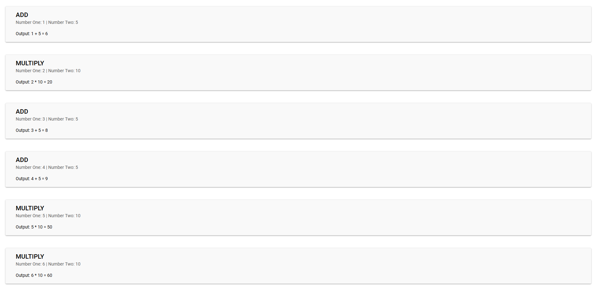

# AngularChallenge

This project was generated with [Angular CLI](https://github.com/angular/angular-cli) version 13.3.0.

## Project Description

- Initialise an Angular project and add angular material as dependency. 
- Put 3 JSON files that you find below into the assets folder. 
- Create a page, which would show a list of operations in this format: 
	1 + 5 = 6 
	2 * 10 = 20 
	etc. 
- You can find a list of operations and values in numbers.json. Each object in this json will contain a value and an action, which is the name of another json you have to query to get the second value to perform the action. 
- If one of the action files is missing (add.json or multiply.json) for corresponding lines, show <MISSING DATA> 
- If «numbers.json» file is missing, show snackbar with description «Server Error» 
- Query json files with HttpClient and split streams for subqueries. switchMap/mergeMap 
- Cover the component and service with unit tests.
 
Numbers.jsoncontent: 
[ {"value": 1, "action": "add"}, {"value": 2, "action": "multiply"}, {"value": 3, "action": "add"}, {"value": 4, "action": "add"}, {"value": 5, "action": "multiply"}, {"value": 6, "action": "multiply"} ] 
 
Add.json content:
{ "value": 5 }
 
Multiply.json content:
{ "value": 10 }

## Output

## Deployment

Angular Challenge project consist of 4 main folders in app folder:
	2 components
	1 service
	1 model
	
### Components
	list-operations
	list-operation
	
### Service
	data-prepare: defining add, multiply and numbers json files url and related function to read these json files and prepare operations object which consist of value_one, value_two and action that create a complete formula. 

### Test

Run `ng test` to execute the unit tests via [Karma](https://karma-runner.github.io).
Unit Test have been executed on 2 components and 1 service.

